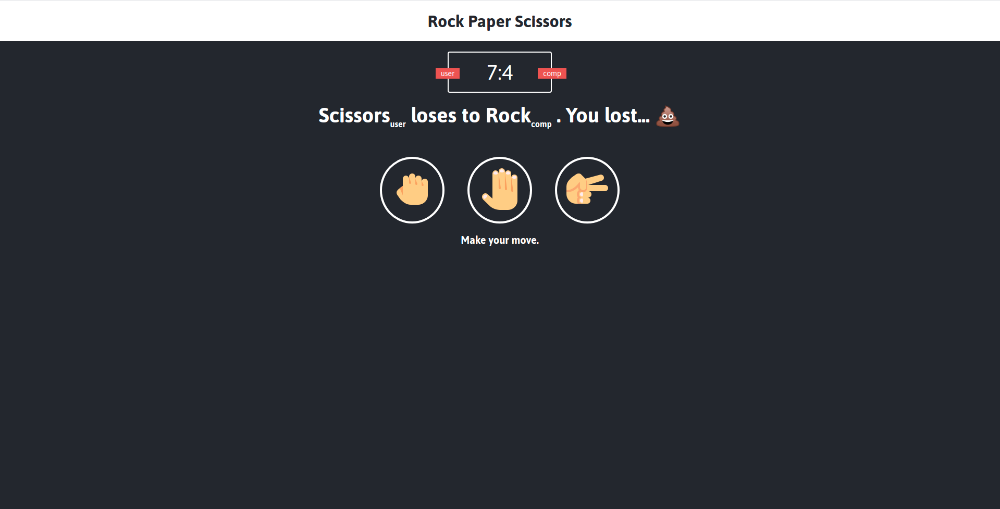

# Rock Paper Scissors

#Learned How Use:

- Math.random,
- Math.floor,
- ES6,
- Using switch over if,
- .fontsize,
- .sub and .sup,
- Template literals,
- .classList.add for CSS classes,

# Extra

- Added @media for mobile use.

## Built With

- HTML
- CSS
- JS

### Usage

[Live Demo Link](https://ramon-carrillo.github.io/RockPaperScissors/)

## Author

👤 Ramon Carrillo

- GitHub: [@githubhandle](https://github.com/Ramon-Carrillo)
- Twitter: [@twitterhandle](https://twitter.com/ramon_de_NL)
- LinkedIn: [linkedin](https://www.linkedin.com/in/ramon-carrillo-54525a1ab/)

## Show your support

Give a ⭐️ if you like this project!

## Acknowledgments

- whatsdev [YouTube](https://www.youtube.com/channel/UC0tRdbXVDbhaRvZPKsRgmxg)
- freeCodeCamp.org [link](https://www.freecodecamp.org/)
- ICONS [link](https://icons8.com/icons)
